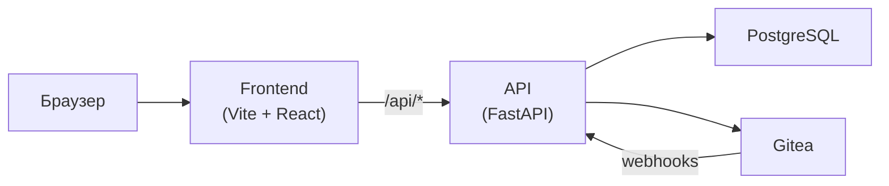

# MTUCI Git Management System

Платформа для управления учебными курсами, лабораторными работами и Git-репозиториями студентов МТУСИ. Приложение объединяет веб-интерфейс, REST API и **Gitea** как хранилище репозиториев.

**Стек:** FastAPI · PostgreSQL · Alembic · React · Vite · Gitea · Docker

---

## Возможности

| Область | Что умеет система |
|--------|-------------------|
| **Курсы и задания** | Создание курсов, заданий, дедлайны, сдача работ через Git, просмотр коммитов по заданию |
| **Репозитории студентов** | Личные репозитории, просмотр кода в UI (ветки, файлы, README, история коммитов, создание файлов) |
| **Gitea** | Создание репозиториев под учётной записью студента, webhooks на push, синхронизация активности |
| **Роли** | Администратор, преподаватель, лаборант, студент — с настраиваемыми правами |
| **Администрирование** | Пользователи, группы, роли, логи, мониторинг, форки, уведомления |

### Интерфейс репозитория (студент)

- Вкладки навигации: **Код**, Issues, Pull requests, Wiki, Settings (внешние ссылки в Gitea)
- Таблица файлов с сообщением и датой последнего коммита
- Боковая панель: Star / Watch / Fork, статистика, недавние коммиты, ссылка на полную историю

---

## Архитектура



- **Frontend** проксирует запросы к API (`/api` → backend).
- **API** хранит пользователей, курсы, задания и метаданные репозиториев в PostgreSQL.
- **Gitea** — фактическое хранилище Git; API создаёт репозитории и читает содержимое через Gitea API.

---

## Требования

- Docker 20+
- Docker Compose v2

---

## Быстрый старт

### 1. Конфигурация

```bash
cp backend/.env.example backend/.env
```

Отредактируйте `backend/.env` при необходимости (см. [Конфигурация](#конфигурация)). Для первого запуска достаточно значений по умолчанию из примера.

### 2. Запуск

```bash
docker compose up --build
```

Первый запуск занимает 2–3 минуты (инициализация Gitea и миграции БД).

| Сервис | URL |
|--------|-----|
| Frontend | http://localhost:3001 |
| API (OpenAPI) | http://localhost:8000/docs |
| Gitea | http://localhost:3000 |

### 3. Первый вход

| Система | Логин | Пароль |
|---------|-------|--------|
| Приложение (супер-админ) | `admin@mtuci.local` | `admin123` |
| Gitea (админ) | `gitea_admin` | `admin12345` |

> ⚠️ Смените пароли и `JWT_SECRET_KEY` перед деплоем в продакшен.

---

## Роли и типичный сценарий

| Роль | Основные действия |
|------|-------------------|
| **Администратор** | Пользователи, роли, системные настройки, логи, мониторинг |
| **Преподаватель** | Курсы, задания, оценки, просмотр репозиториев студентов |
| **Лаборант** | Проверка работ, комментарии, приём лабораторных (по поручению) |
| **Студент** | Курсы, личные репозитории, сдача через Git |

**Пример рабочего процесса:**

1. Администратор или преподаватель создаёт курс и задание с привязкой к Git.
2. Студент регистрируется и указывает **логин Gitea** (`mtuci_login`) в профиле.
3. Студент открывает раздел «Репозитории», создаёт или открывает репозиторий, пушит код в Gitea.
4. Webhook фиксирует push; преподаватель видит коммиты и выставляет оценку.

### Связка студента с Gitea

Репозитории создаются в Gitea под пользователем с логином **`mtuci_login`** (поле в профиле при регистрации или в настройках).

- Логин в приложении и имя пользователя в Gitea должны совпадать по смыслу (например, `yu.e.lashkov`).
- Webhooks сопоставляют события push с пользователем по `mtuci_login`.
- Если репозиторий «не найден» — проверьте, что пользователь есть в Gitea и `mtuci_login` указан верно.

---

## Конфигурация

Основные переменные — в **`backend/.env`** (подключается через `env_file` в `docker-compose.yml`). Полный список — в `backend/.env.example`.

### Gitea: два URL

| Переменная | Назначение |
|------------|------------|
| `GITEA_URL` | Внутренний адрес для API в Docker, например `http://gitea:3000` |
| `GITEA_PUBLIC_URL` | URL для студента в браузере и `git clone`, например `http://localhost:3000` |

В продакшене `GITEA_PUBLIC_URL` обычно указывает на публичный домен вуза (`https://git.university.ru`).

### Gitea Token

По умолчанию API обращается к Gitea через **basic auth** (`gitea_admin` / `admin12345` из docker-compose).  
`GITEA_TOKEN` можно не задавать.

При `docker compose up` сервис **`gitea-bootstrap`** создаёт `gitea_admin`, если в Gitea ещё нет пользователей (бывает, если том Postgres/Gitea остался от старой установки без админа).

Чтобы использовать токен:

1. Откройте http://localhost:3000 → **Settings → Applications → Generate New Token**
2. Добавьте в `backend/.env`: `GITEA_TOKEN=<токен>`
3. Перезапустите API: `docker compose restart api`

### Webhooks

| Переменная | Описание |
|------------|----------|
| `WEBHOOK_BASE_URL` | URL, по которому Gitea достучится до API (в Docker: `http://api:8000/webhooks`) |
| `GITEA_WEBHOOK_SECRET` | Секрет для проверки подписи webhook |

### SMTP (опционально)

Нужен для сброса пароля по email. Заполните в `backend/.env`:

```env
SMTP_HOST=smtp.example.com
SMTP_PORT=587
SMTP_USER=...
SMTP_PASS=...
```

### Прочее

| Переменная | Описание |
|------------|----------|
| `JWT_SECRET_KEY` | Секрет подписи JWT — обязательно сменить в продакшене |
| `MTUCI_CREDENTIALS_SECRET` | Стабильный секрет для шифрования паролей ЛК МТУСИ в базе. Если не задан, используется `JWT_SECRET_KEY` |
| `FRONTEND_URL` | Базовый URL фронтенда (ссылки в письмах, CORS) |
| `ADMIN_EMAIL` / `ADMIN_PASSWORD` | Учётная запись супер-админа при первом старте |

---

## API

Интерактивная документация: **http://localhost:8000/docs**

Основные префиксы:

| Префикс | Назначение |
|---------|------------|
| `/auth` | Регистрация, вход, сброс пароля |
| `/courses` | Курсы, задания, зачисления |
| `/students/me` | Репозитории студента, файлы, ветки, коммиты, summary |
| `/repositories` | Управление репозиториями (преподаватель/админ) |
| `/admin` | Административные операции |
| `/roles` | Роли и права |
| `/webhooks` | Приём событий от Gitea |
| `/activity` | Лента активности |
| `/notifications` | Уведомления |

---

## Команды Docker

```bash
# Логи
docker compose logs -f
docker compose logs -f api

# Перезапуск / остановка
docker compose restart
docker compose restart api          # после смены .env или кода API
docker compose down

# Удалить контейнеры и volumes (полный сброс данных)
docker compose down -v

# Миграции БД
docker compose exec api alembic upgrade heads
docker compose exec api alembic revision --autogenerate -m "описание"
```

---

## Резервное копирование

Сервис **`backup-cron`** в `docker-compose.yml` запускает `scripts/backup.sh` ежедневно в **03:00** (Europe/Moscow).

- Дампы PostgreSQL сохраняются в каталог **`./backups`**
- Файлы старше 30 дней удаляются автоматически
- Ручной запуск:

```bash
docker compose exec backup-cron /backup.sh
```

---

## Локальная разработка

### Frontend (без Docker)

```bash
cd frontend
npm install
npm run dev
```

Dev-сервер: http://localhost:5173. Прокси `/api` → `http://localhost:8000` (задаётся `VITE_PROXY_API`).

### Backend

Удобнее поднимать API через Docker вместе с Postgres и Gitea:

```bash
docker compose up postgres gitea api
```

Либо локально: Python 3.11+, зависимости из `backend/requirements.txt`, переменные из `backend/.env`, `alembic upgrade heads`, затем `uvicorn main:app --reload` из каталога `backend`.

### Сборка фронтенда

```bash
cd frontend && npm run build
```

---

## Структура проекта

```
.
├── backend/
│   ├── app/
│   │   ├── api/routes/       # REST-эндпоинты
│   │   ├── models/           # SQLAlchemy-модели
│   │   ├── schemas/          # Pydantic-схемы
│   │   └── services/         # Бизнес-логика, Gitea, курсы
│   ├── alembic/              # Миграции БД
│   ├── .env.example
│   └── Dockerfile
├── frontend/
│   ├── src/
│   │   ├── components/       # UI, RepoFileBrowser, сайдбар
│   │   ├── pages/
│   │   └── api/              # Клиент к backend
│   └── Dockerfile
├── scripts/
│   └── backup.sh
├── docker-compose.yml
└── docker-entrypoint-initdb.d/
```

---

## Troubleshooting

### Порт занят

Измените левый порт в `docker-compose.yml`:

```yaml
ports:
  - "3002:3001"   # frontend
```

### Ошибка базы данных

Пересоздайте volumes:

```bash
docker compose down -v && docker compose up --build
```

### Frontend не видит API

```bash
curl http://localhost:8000/docs
docker compose ps
```

Убедитесь, что контейнер `api` в состоянии `healthy`.

### Репозиторий «не найден в Gitea»

1. Gitea доступен: http://localhost:3000  
2. В `backend/.env` корректны `GITEA_TOKEN` или `GITEA_ADMIN_*`  
3. У студента заполнен **`mtuci_login`**, пользователь с таким именем есть в Gitea  
4. Репозиторий существует под `{mtuci_login}/{repo_name}`  
5. Перезапуск API: `docker compose restart api`

### 405 Method Not Allowed при создании файла

Старый процесс API без нового маршрута — перезапустите:

```bash
docker compose restart api
```

Проверьте в http://localhost:8000/docs наличие `POST /students/me/repositories/{id}/files`.

### `react-markdown` не найден (Docker)

Volume `node_modules` мог устареть:

```bash
docker compose exec frontend npm install
docker compose restart frontend
```

### Изменения в `.env` не применяются

```bash
docker compose restart api
```

---

## Безопасность (продакшен)

- Смените `JWT_SECRET_KEY`, пароли админа и Gitea  
- Задайте стабильный `MTUCI_CREDENTIALS_SECRET` и храните его вне репозитория
- Задайте надёжный `GITEA_WEBHOOK_SECRET`  
- Используйте HTTPS для `GITEA_PUBLIC_URL` и `FRONTEND_URL`  
- Ограничьте `GITEA__webhook__ALLOWED_HOST_LIST` в `docker-compose.yml`  
- Не коммитьте `backend/.env` в репозиторий  

---

## Лицензия

Учебный проект МТУСИ. Уточните условия использования и распространения у автора репозитория.
